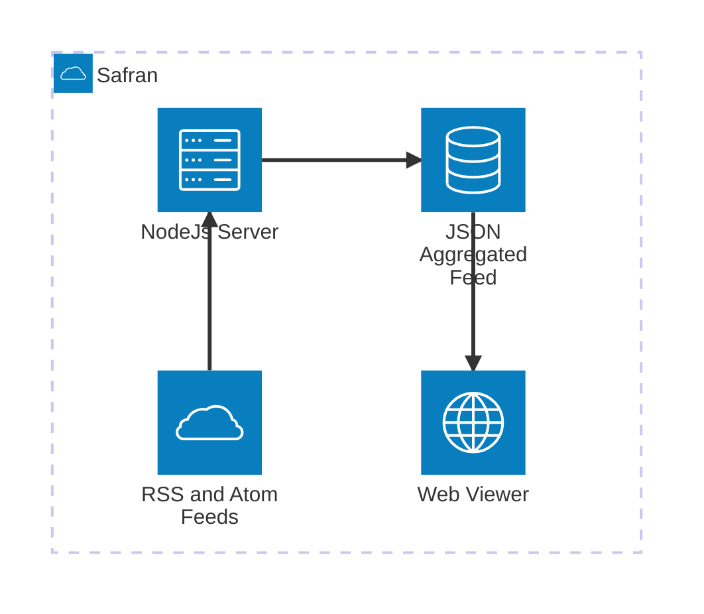

# Safran
> Self-hosted Aggregator For Rss/Atom News

This is a self-hosted solution to consume RSS feeds. It allows you to declare, fetch, parse, format, aggregate, grade, elect, sort, deploy and view them.


## Architecture



## Set up
1. Install all dependencies:
```bash
npm install
```

2. Configure RSS feeds in file `src/feed-configuration`.

3. Add a '.env' file at the root, with FTP deployment configuration:
```bash
FTP_HOST={ftp.my-server.com}
FTP_PATH={/path/on/server}
FTP_USER={username}
FTP_PASSWORD={password}
FTP_SECURE={true|false}
```

4. Build the solution:
```bash
npm run build
```

5. Add crontab to run the script periodically (example below is every `n` minutes):
```bash
*/n * * * * cd ~/path/to/my/repo && /path/to/node dist/index.js
```